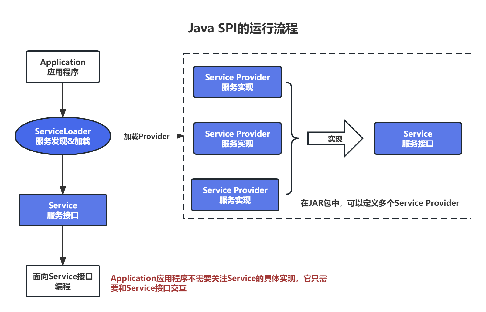
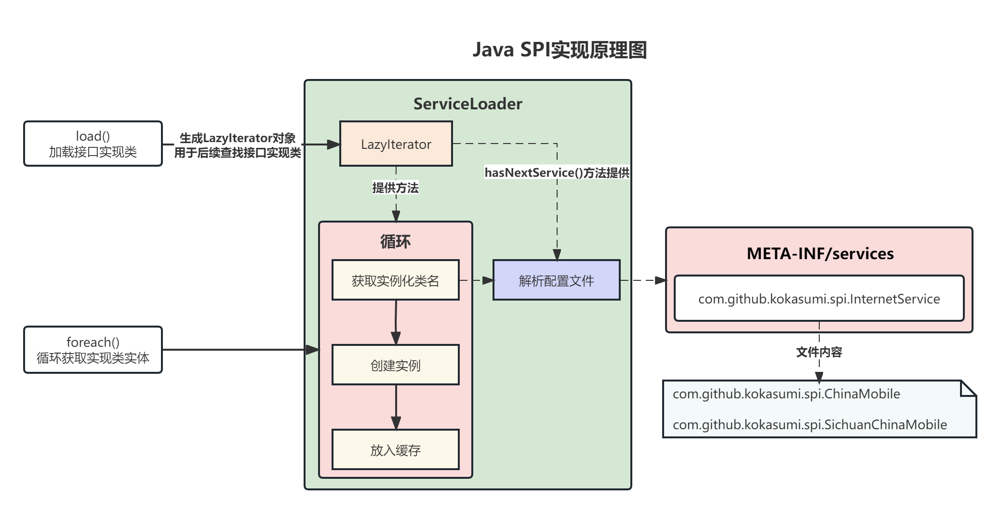
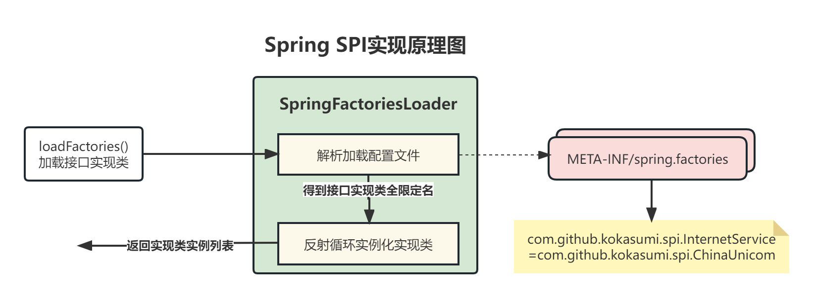

 # 什么是SPI？

**SPI（Service Provider Service）是JDK内置的一种服务提供发现机制，可以用来启用框架扩展和替换组件，主要用于框架开发**，如 `dubbo` 、`spring` 、`common-logging`，`JDBC`都采用了SPI机制，针对同一接口采用不同实现提供给用户，从而提高了框架的扩展性。

Java SPI存在三个核心概念：`Service`、`Service Provider` 和 `ServiceLoader`。

- **Service**：是一个公开的接口或抽象类，定义了一个抽象的功能模块。
- **Service Provider**：是Service接口的一个实现类。
- **ServiceLoader**：是SPI机制中的核心组件，负责在运行时发现并加载Service Provider。



# 怎么理解SPI？

在Java中我们都是通过 JDBC 去进行数据库连接操作的， JDBC 操作数据库一般会经历：**加载驱动**、**打开连接**、**执行语句**、**处理结果集**和**关闭连接**几个操作步骤。不同的厂商都会有各自的一套 JDBC 驱动实现，具体 JDBC 架构图如下图所示：



JDBC要求 `Driver` 实现类在类加载的时候，能将自身的示例对象自动注册到 `DriverManager` 中，从而加载数据库驱动。因此在加载驱动阶段，我们可以通过以下代码进行驱动加载，如下代码所示：

```java
// 1.加载MySQL数据库驱动
Class.forName("com.mysql.jdbc.Driver");
// 加载Oracle驱动
Class.forName("oracle.jdbc.driver.OracleDriver");
// 加载 SqlServer驱动
Class.forName("com.microsoft.sqlserver.jdbc.SQLServerDriver");
// 打开数据库连接
```


这种硬编码方式加载驱动存在一个问题，如果我们想要更换数据库，我们就必须修改加载驱动代码才能实现，违反了开闭原则，不方便后续扩展。如果我们使用 `SPI` ，我们就可以将想要加载的驱动类名直接写到应用的配置文件中，在应用启动时就可以自动加载数据库驱动。符合JDBC 4.0规范的驱动程序包含了一个配置文件 `META-INF/services/java.sql.Driver` ，在这个文件中提供了JDBC驱动实现的类名，因此直接引入数据库驱动的 `jar` 包就可以加载驱动。


面向对象设计中，我们一般推荐模块之间基于接口编程，不对实现类进行硬编码，一旦代码中设计到了具体的实现类，就违反了可插拔的原则，如果需要替换一种实现，就需要修改代码。

要想实现基于接口编程，我们就需要一种在运行时能够动态发现接口实现的机制。**SPI 提供了一种服务发现机制，可以用于启动框架扩展和替换组件，主要是被框架的开发人员使用。**比如在进行JDBC框架开发时，我们并不确定有多少种数据库驱动，因此不能在代码里面写死。这时候我们就需要Java SPI机制，在进行框架开发时基于接口编程，只要厂商基于指定的规则实现驱动，在运行时我们就可以很方便的替换数据库驱动。

# SPI的实现方式

## Java SPI实现

### 设计思想

Java SPI的设计思想是 **面向接口** + **配置文件** + **反射技术**：

1. 面向接口编程保证框架代码不涉及到具体的实现，有利于程序的维护和扩展。
2. 配置文件告诉应用程序需要实例化加载的Service 实现类（Service Provider）。
3. 反射技术用于实例化 Service Provider，因此在Service Provider中必须提供无参的默认构造方法。

配置文件用来指明 `SPI` 管理加载的接口及实现类，配置文件必须遵守以下规范：

- 文件路径：必须在 `jar` 包中的 `META-INF/services`目录下
- 文件名称：Service接口的全限定名
- 文件内容：Service实现类（即Service Provider类）的全限定名。如果有多个实现类，囊二每一个实现类在文件中单独占据一行。

在配置好配置文件后，我们就可以使用 `ServiceLoader.load()`方法来加载接口实现类。

### 简单示例

比如说，有一家公司A，它需要连接互联网，它定义了一个连接网络的API，由中国移动和中国联通来提供网络服务。那么这个场景就涉及到了三方：公司A、中国移动和中国联通。

我们可以抽象一个模块 `simple-api`来提供网路连接的业务接口，`simple-isp-mobile`和`simple-isp-unicom`分别用来实现移动和联通连接网络的业务以及SPI的配置文件，`simple-factory`用于实现公司连接业务的逻辑，如果想要切换网络，只需要修改`simple-api`的实现依赖服务即可实现。




如果以后我们还想接入电信网络，那么只需要新建一个`simple-isp-telecom`，并实现`simple-api`中的接口，并在`META-INF/services`目录下提供配置文件即可。因此想要实现SPI动态加载需要注意以下两个关键点（完整示例代码可见[Java SPI示例代码](../../../code-example/spi-example/java-spi-demo)）：

1. 实现`InternetService`接口，并在 `META-INF/services`目录下提供配置文件`com.github.kokasumi.spi.InternetService`

   

2. 业务代码处面向接口编程，使用 `ServiceLoader` 类加载使用接口实现类，代码如下所示：

   

### Java SPI的实现原理

`ServiceLoader`在加载时会生成一个`LazyIterator`实例，接口的实现类实例都是通过`LazyIterator`去加载生成的，其加载实现原理可通过可见下图：



虽然Java提供的SPI机制非常好，但是也存在相应的弊端：

1. Java SPI在查找扩实现类时需要遍历配置文件，并且将实现类全部实例化，无法按需加载类。
2. 多个接口同样需要多个与之限定类名匹配的配置文件。

## Spring SPI实现

Spring SPI 沿用了Java SPI的设计思想，Spring 采用的是`spring.factories`方式实现SPI机制，可以在不修改Spring源码的前提下，提供Spring框架的扩展性。

Spring SPI与Java SPI最大的不同点在于配置文件方面：

- Java SPI是一个服务提供接口对应一个配置文件，配置文件中存放当前接口的所有实现类，多个服务提供接口对应多个配置文件，所有的配置文件都在`META-INF/services`目录下；
- Spring SPI只有一个配置文件 `spring.factories`，配置文件中存放多个接口及对应的实现类，以接口全限定名作为`key`，实现类作为`value`来配置，多个实现类用逗号隔开。

### 示例代码

同样还是以上面的公司连接网络为例，我们使用Spring SPI实现代码（完整示例代码可见[Spring SPI示例代码](../../../code-example/spi-example/spring-spi-demo)）：

1. 实现`InternetService`接口，并在 `META-INF/spring.factories`文件中提供实现类配置

   ```properties
   com.github.kokasumi.spi.InternetService=com.github.kokasumi.spi.ChinaMobile,\
     com.github.kokasumi.spi.SichuanChinaMobile
   ```

2. 业务代码处面向接口编程，使用 `SpringFactoriesLoader` 类加载使用接口实现类，代码如下所示：

   ```java
   // 获取所有factories文件中配置的InternetService
   List<InternetService> internetServices = SpringFactoriesLoader.loadFactories(
       InternetService.class,Thread.currentThread().getContextClassLoader());
   internetServices.forEach(t -> t.connectInternet());
   ```

### Spring SPI的实现原理

Spring SPI是使用 `SpringFactoriesLoader` 类去加载生成所有实例类的，其加载原理可见下图：



## Dubbo SPI

Dubbo就是通过SPI机制加载所有的组件。但是，Dubbo没有使用Java原生的SPI机制，而是对其进行了增强，使其能够更好的满足需求。在Dubbo中，SPI是一个很重要的模块。基于SPI，我们可以很容易的对Dubbo进行扩展。

Dubbo中实现了一套新的SPI机制，功能更强大，也更复杂一些。相关逻辑都被封装在了`ExtensionLoader` 类中，通过`ExtensionLoader`，我们可以加载指定的实现类。

Dubbo 对配置文件目录的约定，不同于 Java SPI ，Dubbo 分为了三类目录。

- `META-INF/services/` 目录：该目录下的 SPI 配置文件是为了用来兼容 Java SPI 。
- `META-INF/dubbo/` 目录：该目录存放用户自定义的 SPI 配置文件。
- `META-INF/dubbo/internal/` 目录：该目录存放 Dubbo 内部使用的 SPI 配置文件。

我们自定义的SPI配置文件需放在`META-INFO/dubbo`文件夹下，配置内容如下：

```properties
optimusPrime = org.apache.spi.OptimusPrime
bumblebee = org.apache.spi.Eumblebee
```

与Java SPI实现类配置不同，Dubbo SPI是通过键值对的方式进行配置，这样我们就可以按需加载指定的实现类。另外在使用时还需要在接口上标注`@SPI`注解。下面来掩饰Dubbo SPI的用法：

```java
@SPI
public interface Robot {
    void sayHello();
}

public class OptimusPrime implements Robot {
    
    @Override
    public void sayHello() {
        System.out.println("Hello, I am Optimus Prime.");
    }
}

public class Bumblebee implements Robot {

    @Override
    public void sayHello() {
        System.out.println("Hello, I am Bumblebee.");
    }
}


public class DubboSPITest {

    @Test
    public void sayHello() throws Exception {
        ExtensionLoader<Robot> extensionLoader = 
            ExtensionLoader.getExtensionLoader(Robot.class);
        Robot optimusPrime = extensionLoader.getExtension("optimusPrime");
        optimusPrime.sayHello();
        Robot bumblebee = extensionLoader.getExtension("bumblebee");
        bumblebee.sayHello();
    }
}
```

**Dubbo SPI 和 JDK SPI 最大的区别就在于支持“别名”**，可以通过某个扩展点的别名来获取固定的扩展点。就像上面的例子中，我可以获取 Robot 多个 SPI 实现中别名为“optimusPrime”的实现，也可以获取别名为“bumblebee”的实现，这个功能非常有用！

通过 `@SPI` 注解的 `value` 属性，还可以默认一个“别名”的实现。比如在Dubbo 中，默认的是Dubbo 私有协议：**dubbo protocol - dubbo://**

来看看Dubbo中协议的接口：

```java
@SPI("dubbo")
public interface Protocol {
    ......
}
```

在 Protocol 接口上，增加了一个 `@SPI` 注解，而注解的 `value` 值为 `Dubbo` ，通过 SPI 获取实现时就会获取 Protocol SPI 配置中别名为dubbo的那个实现，`com.alibaba.dubbo.rpc.Protocol`文件如下：

```properties
filter=com.alibaba.dubbo.rpc.protocol.ProtocolFilterWrapper
listener=com.alibaba.dubbo.rpc.protocol.ProtocolListenerWrapper
mock=com.alibaba.dubbo.rpc.support.MockProtocol


dubbo=com.alibaba.dubbo.rpc.protocol.dubbo.DubboProtocol


injvm=com.alibaba.dubbo.rpc.protocol.injvm.InjvmProtocol
rmi=com.alibaba.dubbo.rpc.protocol.rmi.RmiProtocol
hessian=com.alibaba.dubbo.rpc.protocol.hessian.HessianProtocol
com.alibaba.dubbo.rpc.protocol.http.HttpProtocol
com.alibaba.dubbo.rpc.protocol.webservice.WebServiceProtocol
thrift=com.alibaba.dubbo.rpc.protocol.thrift.ThriftProtocol
memcached=com.alibaba.dubbo.rpc.protocol.memcached.MemcachedProtocol
redis=com.alibaba.dubbo.rpc.protocol.redis.RedisProtocol
rest=com.alibaba.dubbo.rpc.protocol.rest.RestProtocol
registry=com.alibaba.dubbo.registry.integration.RegistryProtocol
qos=com.alibaba.dubbo.qos.protocol.QosProtocolWrapper
```

然后只需要通过`getDefaultExtension`，就可以获取到 `@SPI` 注解上`value`对应的那个扩展实现了。

```java
Protocol protocol = ExtensionLoader.getExtensionLoader(Protocol.class).getDefaultExtension();
//protocol: DubboProtocol
```

Dubbo 的 SPI 中还有一个“加载优先级”，优先加载内置（internal）的，然后加载外部的（external），按优先级顺序加载，**如果遇到重复就跳过不会加载**了。

## SPI实现对比

|                    | JDK SPI                        | Spring SPI                                                   | Dubbo SPI                                                    |
| ------------------ | ------------------------------ | ------------------------------------------------------------ | ------------------------------------------------------------ |
| 文件方式           | 每个扩展点单独一个文件         | 所有扩展点一个文件                                           | 每个扩展点单独一个文件                                       |
| 获取某个固定的实现 | 不支持，只能按顺序获取所有实例 | 不支持，只能按顺序获取所有实例。但由于Spring Boot ClassLoader会优先加载用户代码中的文件，所以可以保证用户自定义的 `spring.factories` 文件在第一个，通过获取第一个`factory`的方式就可以固定获取自定义的扩展 | 有“别名”的概念，可以通过名称获取扩展点上的某个固定实现，配合Dubbo SPI的注解很方便 |
| 文档完整度         | 文章&三方资料足够丰富          | 文档不够丰富，但由于功能少，使用非常简单                     | 文档&三方资料足够丰富                                        |
| IDE支持            | 无                             | IDEA完美支持，有语法提示                                     | 无                                                           |
| 其他               | 无                             | 无                                                           | 支持Dubbo内部的依赖注入，通过目录来区分Dubbo内置SPI和外部SPI，优先加载内部，保证内部的优先级最高 |

# 参考资料

1. [10分钟让你彻底明白Java SPI，附实例代码演示#安员外很有码](https://www.bilibili.com/video/BV1RY4y1v7mN/?spm_id_from=333.788&vd_source=feb69afedc90bcef3aa8afbf638a88db)
2. [【431期】面试官：聊聊 SpringBoot 中的 SPI 机制](https://www.bmabk.com/index.php/post/125876.html)
3. [阿里面试真题：Dubbo的SPI机制](https://blog.csdn.net/qq_35190492/article/details/108256452)
4. [JDK/Dubbo/Spring 三种 SPI 机制，谁更好？](https://segmentfault.com/a/1190000039812642)

