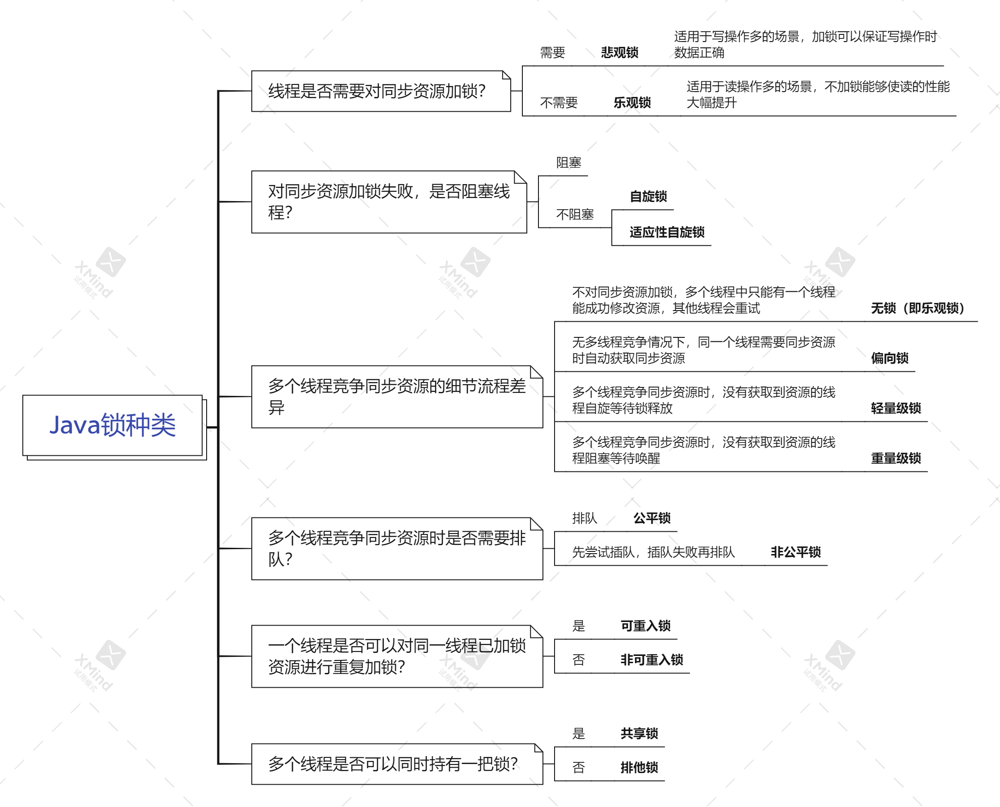
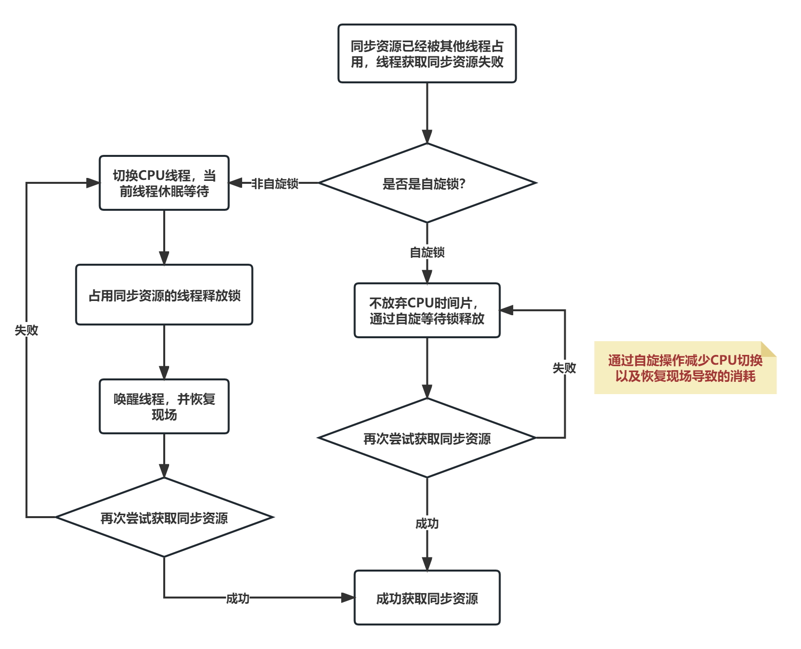

# 乐观锁 VS 悲观锁

乐观锁和悲观锁是一种广义上的概念，体现了看待线程同步的不同角度。在Java和数据库中都有此概念对应的实际应用。

对于同步数据的并发操作，**悲观锁** 总是会假设遇到最坏情况，每次访问数据时总会有其他线程来修改数据，因此在访问数据之前会先加锁，确保数据不会被其他线程修改。

**乐观锁** 与悲观锁相反，总是会假设最好的情况，每次访问数据都不会有其他线程来修改数据，所以不会加锁，只是在更新数据会判断有没有其他线程已经更新了数据。如果数据没有被更新，当前线程将修改的数据成功写入；如果数据已经被其他线程更新，则根据不同的实现方式执行不同的操作（如报错或自动重试）。

在Java中，关键字 `synchronized`和 `Lock`的实现类都是悲观锁。乐观锁在 Java 中是通过无锁编程来实现的，最常采用的是 `CAS`算法，Java 原子类中的递增操作就是通过 `CAS`自旋实现的。


# 自旋锁 VS 适应性自旋锁



阻塞或唤醒一个Java线程需要操作系统切换CPU状态，这种状态转换需要耗费处理器时间。如果同步代码块中的内容过于简单，状态转换消耗的时间有可能比用户代码执行的时间还要长。

在许多场景中，同步资源的锁定时间很短，为了这一小段时间去切换线程，线程挂起和恢复现场的花费可能让系统得不偿失。如果物理及其有多个处理器，能够让两个或以上的线程同时并发执行，我们可以让当前请求同步资源的线程进行自旋，不放弃 CPU 的执行时间，如果在自旋完成后前面锁定同步资源的线程已经释放了锁，那么当前线程可以直接获取获取同步资源，从而避免了线程切换的开销，这就是**自旋锁**。

自旋锁虽然避免了线程切换的开销，但它要占用处理器时间。如果锁被占用的时间很短，自旋等待的效果就非常好。反之，如果锁被占用的时间很长，那么自旋的线程只会白白浪费处理器资源。所以，自旋等待的时间必须要有一定的限度，如果自旋超过了限定次数没有成功获取到同步资源（默认是10次，可以通过 `-XX:PreBlockSpin` 来修改），就应当挂起线程。

在JDK 6中引入了 **适应性自旋锁**，自旋的时间（次数）不再固定，而是由前一个在同一个锁上的自旋时间及锁的拥有者状态来决定。如果在同一个锁对象上，自旋等待刚刚成功获取过锁，并且持有锁的线程正在运行中，那么虚拟机就会认为这次自旋也很有可能再次成功，进而允许自旋等待持续相对较长的时间。如果对于某个锁，自旋很少成功过，那在以后尝试获取这个锁时可能省略掉自旋过程，直接阻塞线程，避免浪费处理器资源。

# 无锁 VS 偏向锁 VS 轻量级锁 VS 重量级锁


**无锁：**

没有对同步资源进行锁定，所有线程都能访问并修改同一个资源，但同时只有一个线程能够修改成功。

无锁的特点就是修改操作在循环内进行，线程会不断尝试修改同步资源。如果没有冲突就修改成功并退出循环，否则就会继续循环尝试。如果有多个线程修改同一个资源，必定有一个线程能修改成功，而其他修改失败的线程会不断重试直到修改成功。无锁无法全面代替有锁，但无锁在某些场合下的性能是非常高的。

**偏向锁：**

偏行锁是指在没有多线程竞争的情况下，同一个同步资源被相同线程访问时，该线程会自动获取到锁，降低获取锁的代价。

在大多数情况下，锁总是由同一个线程多次获得，不存在多线程竞争，所以出现了偏向锁。其目标就是在只有一个线程执行同步代码块时能够提高性能。

线程不会主动释放偏向锁，只有在遇到其他线程尝试竞争偏向锁时，持有偏向锁的线程才会释放锁。偏向锁的撤销，需要等待全局安全点（在这个时间点上没有字节码正在执行），它会首先暂停拥有偏向锁的线程，判断锁对象是否处于被锁定状态。撤销偏向锁后恢复到无锁或轻量级锁状态。

**轻量级锁：**

当锁是偏向锁时，被另外的线程访问，偏向锁就会升级为轻量级锁，其他线程通过自旋的形式尝试获取锁，不会阻塞，从而提高性能。

若当前只有一个等待线程，则该线程通过自旋进行等待。但是当自旋超过一定次数，或者同时有三个以上线程争夺同一个锁时，轻量级锁会升级为重量级锁。

**重量级锁：**

当锁为重量级锁时，线程获取锁资源失败时会放弃CPU时间片，进入阻塞状态，当持锁线程释放锁资源时，会唤醒该线程继续抢夺同步资源。线程的阻塞和唤醒，都需要通过操作系统来实现，这种转换是非常消耗资源的。

# 公平锁 VS 非公平锁

**公平锁**是指多个线程按照申请锁的顺序来获取锁，线程直接进入队列中排队，队列中的第一个线程才能获取到锁。公平锁的优点是等待锁的线程不会饿死。缺点是整体吞吐效率相对非公平锁要低，等待队列中除第一个线程以外的所有线程都会阻塞，CPU唤醒阻塞线程的开销比非公平锁大。


**非公平锁**是多个线程加锁时直接尝试获取锁，获取不到才会到等待队列的队尾等待。但如果此时锁刚好可用，那么这个线程就可以无需阻塞直接获取到锁，所以非公平锁有可能出现后申请锁的线程先获取到锁的情况。非公平锁的优点是可以减少唤起线程的开销，整体的吞吐效率高，因为线程有几率不阻塞线程直接获取到锁。缺点是处于等待队列中的线程可能会饿死，或者等很久才会获得锁。


# 可重入锁 VS 非可重入锁

**可重入锁**又名递归锁是指，在同一个线程在外层方法获取到锁，再进入该线程的内层方法时会自动获取到锁（前提锁对象是同一个对象或`class`），不会因为之前已经获取过锁还没释放而阻塞。Java中的`ReentrantLock` 和 `synchronized` 关键字都是可重入锁，可重入锁的一个优点是可一定程度上避免死锁。

```java
public class Widget {
    public synchronized void doSomething() {
        System.out.println("方法1执行...");
        doOthers();
    }

    public synchronized void doOthers() {
        System.out.println("方法2执行...");
    }
}
```


**非可重入锁**在外层方法获取到锁时，内层方法由于无法自动获取到锁，会等待外层方法释放锁，而外层方法需要等待内层方法执行完成才会释放锁，这样就会发生死锁。


# 共享锁 VS 排他锁

**共享锁** 是指锁可被多个线程同时持有。如果一个线程对数据加上共享锁以后，那么其他线程只能对数据再加共享锁，不能加排他锁。获得共享锁的数据只能读数据，不能写数据。JDK中的 `ReentrantReadWriteLock` 就是一种共享锁。


**排他锁** 是指锁在同一时间只能被一个线程持有。如果一个线程对共享资源加排他锁后，那么其他线程不能再对该共享资源加锁。获得排他锁的线程，既能读取数据也能修改数据。JDK中的 `synchronized` 和 `java.util.concurrent(JUC)` 包中 Lock的实现类就是排他锁。


# 参考资料

1. [不可不说的Java“锁”事](https://tech.meituan.com/2018/11/15/java-lock.html)