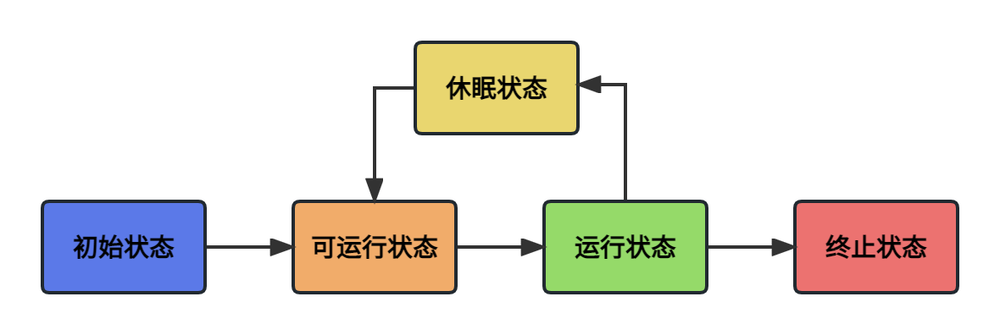
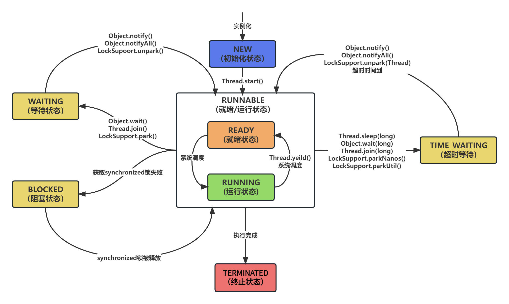

线程的生命周期指的是从线程创建到销毁的整个过程，通常情况下线程的生命周期有以下5种：**初始状态**、**可运行状态**、**运行状态**、**休眠状态** 和 **终止状态**。

Java线程的生命周期与通用线程生命周期是不同的，它有以下6种状态：

- **NEW（初始化状态）**：表示线程新建出来还没有启动的状态，比如：`Thread t = new Thread()`。
- **RUNNABLE（就绪/运行状态）**：该状态包含了经典线程生命周期的两种状态，就绪和运行状态。就绪状态说明线程可以运行，但是需要等待操作系统调度后才能进入运行状态。
- **BLOCKED（阻塞状态）**：通常与锁有关系，表示线程正在获取有锁控制的资源，比如进入`synchronized`代码块，等待锁释放资源；发起阻塞式I/O也会阻塞，比如字符流/字节流操作。
- **WAITING（等待状态）**：表示线程在等待某种资源就绪，需要其他线程唤醒或中断。
- **TIME_WAITING（超时等待状态）**：与等待状态类似，不同的是它在等待一定时间后可以自行唤醒。
- **TERMINATED（终止状态）**：线程正常退出或异常退出后，就处于终止状态。

