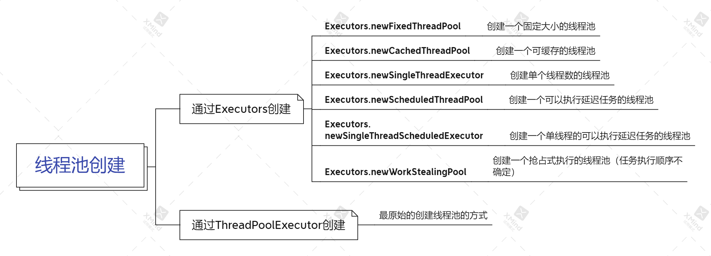
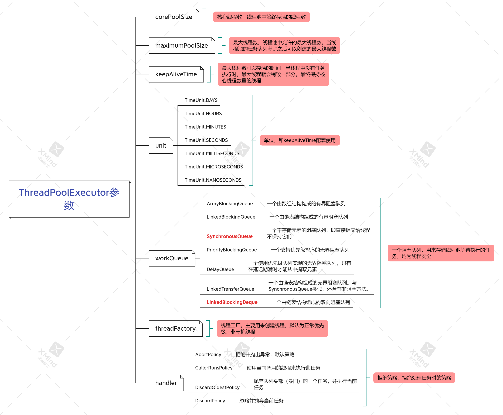
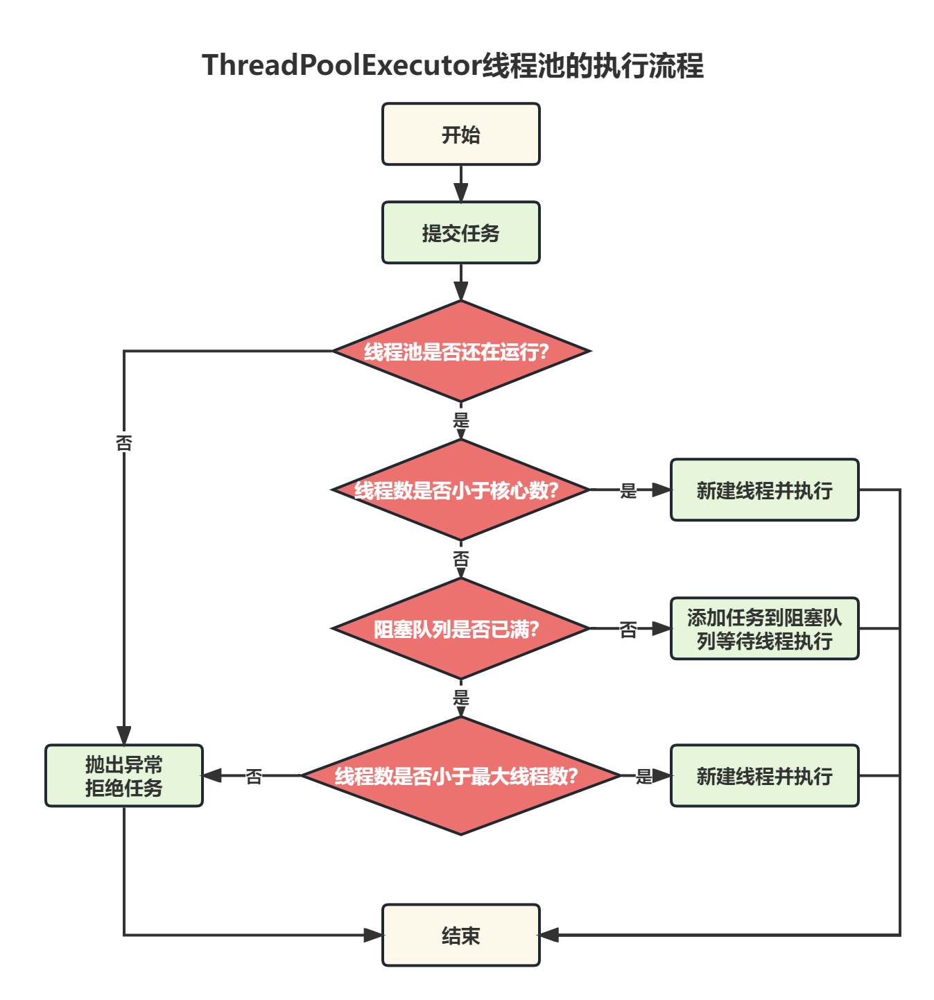

# 什么是线程池?

**线程池（ThreadPool）**是一种基于池化思想管理和使用线程的机制。它是将多个线程预先存储在一个“池子”内，当有任务出现时可以避免重新创建和销毁线程所带来的性能开销，只需要从“池子”内取出相应的线程执行对应的任务即可。

池化思想在计算机的应用也比较广泛，比如以下这些：

- 内存池（Memory Pooling）：预先申请内存，提升申请内存速度，减少内存碎片。
- 连接池（Connection Pooling）：预先申请数据库连接，提升申请连接的速度，降低系统的开销。
- 实例池（Object Pooling）：循环使用对象，减少资源在初始化和释放时的昂贵耗损。

线程池的优势主要体现在以下4点：

1. **降低资源消耗**：通过池化技术重复利用已创建的线程，降低线程创建和销毁造成的损耗。
2. **提高响应速度**：任务到达时，无需等待线程创建即可立即执行。
3. **提高线程的可管理性**：线程是稀缺资源，如果无限制创建，不仅会消耗系统资源，还会因为线程的不合理分布导致资源调度失衡，降低系统的稳定性。使用线程池可以进行统一的分配、调优和监控。
4. **提供更多更强大的功能**：线程池具备可拓展性，允许开发人员向其中增加更多的功能。

同时**阿里巴巴在其《Java开发手册》中也强制规定：线程资源必须通过线程池提供，不允许在应用中自行显式创建线程。**

> 说明：线程池的好处是减少在创建和销毁线程上所消耗的时间以及系统资源的开销，解决资源不足的问题。如果不使用线程池，有可能造成系统创建大量同类线程而导致消耗完内存或者“过度切换”的问题。

# 线程池有几种创建方式？

线程池的创建方法总共有7种，但总体来说可分为2类：

- 通过 `ThreadPoolExecutor` 创建的线程池；
- 通过 `Executors` 创建的线程池。



## FixedThreadPool

创建一个固定大小的线程池，可控制并发的线程数，超出的线程会在队列中等待。使用示例如下：

```java
public static void fixedThreadPool() {
    // 创建2个并发线程的线程池
    ExecutorService threadPool = Executors.newFixedThreadPool(2);
    // 创建任务
    Runnable runnable = new Runnable() {
        @Override
        public void run() {
            System.out.println("任务被执行,线程:" + Thread.currentThread().getName());
        }
    }
    
    // 执行任务的方法有两种：submit和execute
    threadPool.submit(runnable);
    threadPool.execute(runnable);
}
```

## CachedThreadPool

创建一个可缓存的线程池，如果线程数超过处理所需，缓存一段时间后会回收，如果线程数不够，则新建线程。使用示例如下：

```java
public static void cachedThreadPool() {
    // 创建线程池
    ExecutorService threadPool = Executors.newCachedThreadPool();
    // 执行任务
    for (int i = 0; i < 10; i++) {
        threadPool.execute(() -> {
            System.out.println("任务被执行,线程:" + Thread.currentThread().getName());
            try {
                TimeUnit.SECONDS.sleep(1);
            } catch (InterruptedException e) {
            }
        });
    }
}
```

## SingleThreadExecutor

创建单个线程数的线程池，它可以保证先进先出的执行顺序。使用示例如下：

```java
public static void singleThreadExecutor() {
    // 创建线程池
    ExecutorService threadPool = Executors.newSingleThreadExecutor();
    // 执行任务
    for (int i = 0; i < 10; i++) {
        final int index = i;
        threadPool.execute(() -> {
            System.out.println(index + ":任务被执行");
            try {
                TimeUnit.SECONDS.sleep(1);
            } catch (InterruptedException e) {
            }
        });
    }
}
```

## ScheduledThreadPool

创建一个可以执行延迟任务的线程池。使用示例如下：

```java
public static void scheduledThreadPool() {
    // 创建线程池
    ScheduledExecutorService threadPool = Executors.newScheduledThreadPool(5);
    // 添加定时执行任务(1s 后执行)
    System.out.println("添加任务,时间:" + new Date());
    threadPool.schedule(() -> {
        System.out.println("任务被执行,时间:" + new Date());
        try {
            TimeUnit.SECONDS.sleep(1);
        } catch (InterruptedException e) {
        }
    }, 1, TimeUnit.SECONDS);
}
```

## SingleThreadScheduledExecutor

创建一个单线程的可以执行延迟任务的线程池。使用示例如下：

```java
public static void SingleThreadScheduledExecutor() {
    // 创建线程池
    ScheduledExecutorService threadPool = Executors.newSingleThreadScheduledExecutor();
    // 添加定时执行任务(2s 后执行)
    System.out.println("添加任务,时间:" + new Date());
    threadPool.schedule(() -> {
        System.out.println("任务被执行,时间:" + new Date());
        try {
            TimeUnit.SECONDS.sleep(1);
        } catch (InterruptedException e) {
        }
    }, 2, TimeUnit.SECONDS);
}
```

## newWorkStealingPool

创建一个抢占式执行的线程池（任务执行顺序不确定），注意此方法只有在 `JDK 1.8+` 版本中才能使用。使用示例如下：

```java
public static void workStealingPool() {
    // 创建线程池
    ExecutorService threadPool = Executors.newWorkStealingPool();
    // 执行任务
    for (int i = 0; i < 10; i++) {
        final int index = i;
        threadPool.execute(() -> {
            System.out.println(index + " 被执行,线程名:" + Thread.currentThread().getName());
        });
    }
    // 确保任务执行完成
    while (!threadPool.isTerminated()) {
    }
}
```

## ThreadPoolExecutor

最原始的创建线程池的方式，它包含了7个参数可供设置。使用示例如下：

```java
public static void myThreadPoolExecutor() {
    // 创建线程池
    ThreadPoolExecutor threadPool = new ThreadPoolExecutor(5, 10, 100, TimeUnit.SECONDS, new LinkedBlockingQueue<>(10));
    // 执行任务
    for (int i = 0; i < 10; i++) {
        final int index = i;
        threadPool.execute(() -> {
            System.out.println(index + " 被执行,线程名:" + Thread.currentThread().getName());
            try {
                Thread.sleep(1000);
            } catch (InterruptedException e) {
                e.printStackTrace();
            }
        });
    }
}
```

### ThreadPoolExecutor 参数介绍



### 线程池的执行流程

`ThreadPoolExecutor` 关键节点的执行流程如下：

- 当线程数小于核心线程数时，创建线程。
- 当线程数大于等于核心线程数，且任务队列未满时，将任务放入任务队列。
- 当线程数大于等于核心线程数，且任务队列已满时，若线程数小于最大线程数，创建线程；若线程数等于最大线程数，抛出异常，拒绝任务。



# 怎么选择创建线程池的方式？

我们应该怎么选择线程池创建方式呢？阿里巴巴《Java开发手册》中给了我们答案：

> 【强制要求】线程池不允许使用 `Executors` 去创建，而是通过 `ThreadPoolExecutor` 的方式来创建，这样的处理方式让写的同学更加明确线程池的运行规则，规避资源耗尽的风险。
>
> 说明：`Executors` 创建的线程池对象具有以下弊端：
>
> 1. `FixedThreadPool ` 和 `SingleThreadPool`：允许的请求队列长度为 `Integer.MAX_VALUE`，可能会堆积大量的请求，从而导致OOM。
> 2. `CachedThreadPool`：允许创建的线程数量为 `Integer.MAX_VALUE`，可能会大量创建线程，从而导致 OOM。

因此，我们推荐使用 `ThreadPoolExecutor` 的方式进行线程池的创建，因为这种创建方式更可控，并且更加明确了线程池的运行规则，可以规避一些未知的风险。

# 参考资料

1. [线程池的7种创建方式，强烈推荐你用它...](https://www.cnblogs.com/vipstone/p/14149065.html)