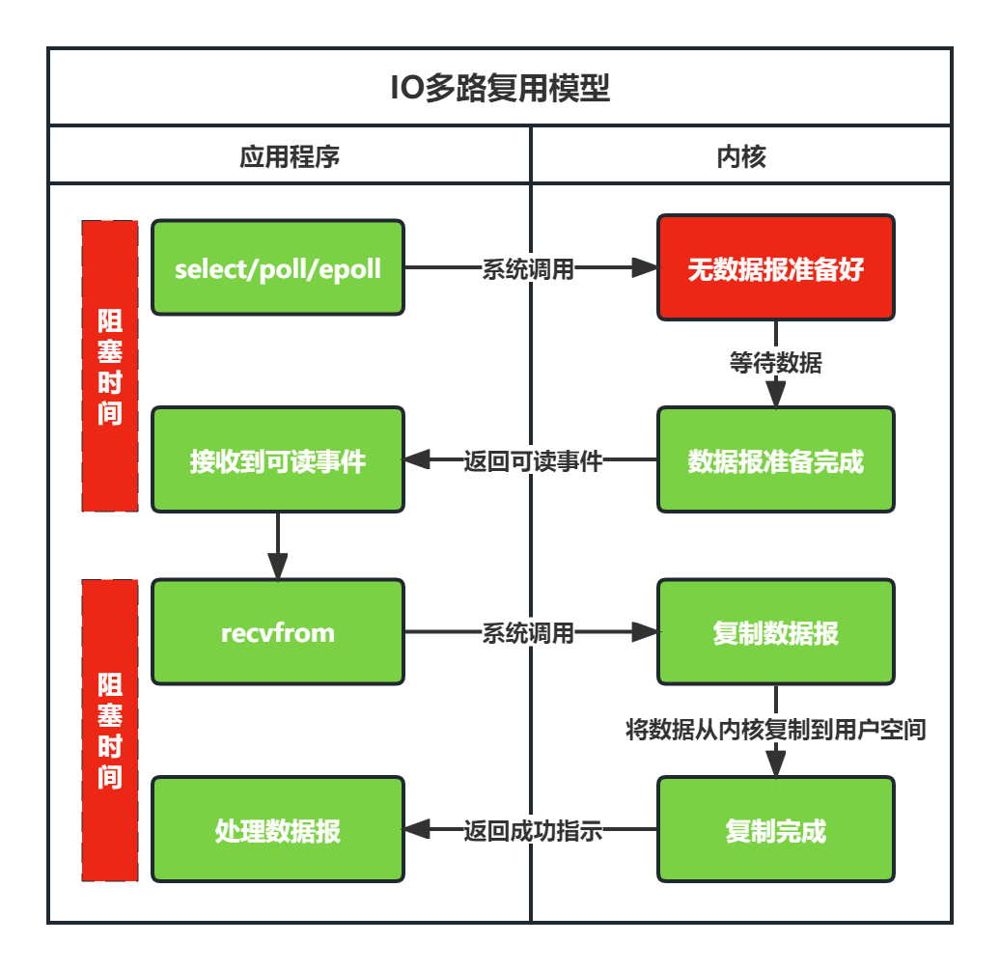

# IO的定义

我们平时开发的应用程序一般都是以文件形式存放到磁盘中的，应用程序只有加载到内存中才能运行。应用程序运行在计算机内存中，必然会涉及到数据交换，比如读写磁盘文件、访问数据库、远程调用API等，这种数据交换的过程就是IO。

操作系统为了确保安全稳定地运行，将内存分为了内核空间和用户空间，进行内存隔离。我们构建的程序运行在用户空间，用户空间的程序无法直接操作内核空间，这也就意味着用户空间的程序无法直接访问由内核管理的IO，比如：硬盘、网卡等。

操作系统对外提供了API访问接口，以对外提供安全的访问控制。应用程序想要访问内核管理的IO，必须通过调用内核提供的系统调用（`System Call`）进行间接访问。总的来说，IO分为两个阶段：

1. **数据准备阶段**：内核等待IO设备准备好数据
2. **数据复制阶段**：内核将内核缓冲区的数据复制到用户空间缓冲区

# IO模型分类

应用程序从发起IO请求到IO执行完成这个阶段，根据应用程序进程的不同状态，可以将I/O模型分为：**阻塞IO**、**非阻塞IO**、**IO多路复用**、**信号驱动IO**和**异步IO**。

## 阻塞IO（BIO）

**从发起IO请求到IO执行完成的整个过程，应用程序进程都处于阻塞状态，这种IO被称为阻塞IO**。阻塞I/O简称为 **BIO（Blocking IO）** ，其处理流程如下图所示：

**优点**：

BIO的程序简单，在阻塞等待数据期间进程/线程挂起，基本不会占用CPU资源。

**缺点**：

BIO存在一个问题，**如果内核数据需要耗时很久才准备好，那么用户进程将会长时间处于阻塞状态，无法及时处理其他请求，浪费性能**。虽然可以通过多线程来提升性能，但线程的创建依然会借助系统调用，同样多线程会导致频繁的线程上下文切换，同样会影响性能。

## 非阻塞IO（NIO）

阻塞IO存在问题的本质就在于阻塞，因此为了解决阻塞IO带来的性能问题，我们可以将阻塞IO变为非阻塞。**用户进程在发起系统调用时指定为非阻塞请求，内核在接受到请求之后，就会马上返回，然后用户进程通过轮询的方式来拉取处理结果**。这种IO模型叫做**非阻塞IO模型**，简称为 **NIO（Non-Blocking IO）**。

**优点**：

NIO不会阻塞在内核的等待数据过程，每次发起的I/O请求可以立即返回，不用阻塞等待，实时性较好。

**缺点**：

**如果内核数据需要耗时很长才准备好，频繁的轮询有多数的系统调用是无效的，系统的资源利用率较低，造成严重的性能浪费**。比如说有1000个并发，那么单位时间内循环将会有1000次系统调用去轮询执行结果，但实际上可能只有2个请求结果执行完毕，这就会有998次无效的系统调用，造成严重的性能浪费。

## IO多路复用（IO Multiplexing）

NIO问题的本质在于频繁的轮询导致大量的无效系统调用，那么解决NIO的思路就是降解无效的系统调用。

**IO多路复用（IO multiplexing），使用系统内核提供的`select/poll/epoll`等系统调用函数，支持一次查询多个文件描述符的可用状态，当任意一个结果状态可用时就会返回，用户进程再发起一次系统调用进行数据读取。**换句话说，就是 NIO 中 N 次的系统调用，借助 `select/poll/epoll` ，只需要发起一次系统调用就可以了。其IO流程如下所示：

**优点**：

IO多路复用可以一个线程同时监控多个文件描述符的数据状态，对就绪的每个数据开一个线程处理数据复制即可，这样需要的线程数大大减少，减少了内存和上下文切换的开销。

**缺点**：

当连接数较少时效率相比 多线程+阻塞IO模型 效率较低，可能延迟更大，因为单个连接处理需要2次系统调用，占用的时间会有所增加。

## 信号驱动IO（SIGIO）

**信号驱动式I/O（signal-driven I/O），就是指在描述符准备就绪的时候，让内核发送一个SIGIO信号通知应用程序进行后续的数据复制等处理。**信号驱动式IO与NIO的最大区别就在于，在IO执行的数据准备阶段，不会阻塞用户进程。

**优点**：

SIGIO在内核等待数据期间线程并没有阻塞，可以提高资源的利用率。

**缺点**：

SIGIO在大量IO操作时可能会因为信号队列溢出导致无法通知应用程序。

## 异步IO（AIO）

异步IO真正实现了全流程的非阻塞。**用户进程发出系统调用后立即返回，内核等待数据准备完成，然后将数据拷贝到用户进程缓冲区，然后发送信号告诉用户进程IO操作执行完成。**其流程如下：

**优点**：

异步IO能够充分利用DMA特性，让IO操作与计算重叠。

**缺点**：

要实现真正的异步IO，操作系统需要做大量的工作。目前Windows下通过IOCP实现了真正的异步IO。而在Linux系统下，Linux 2.6才引入，目前AIO并不完善，因此在Linux下实现高并发网络编程时都是以IO多路复用模型为主。

# 总结

在IO模型分类中，有两组基本概念：阻塞和非阻塞，同步和异步。针对这两组概念有以下理解：

1. 阻塞是指调用方在结果返回之前一直处于阻塞状态，非阻塞则表达调用方在等待结果期间可以去做其他事情；
2. 同步是指被调用方得到最终结果之后才会返回给调用方，异步则是指被调用方先返回应答，然后再计算调用结果，计算完最终结果后再通知返回给调用方。
3. 阻塞和非阻塞的讨论对象是调用者；同步和异步的讨论对象是被调用者

# 参考资料

1. [I/O模型的分类及简介](https://www.linuxprobe.com/io-nio-bio.html)
2. [网络编程必备知识：图解Socket核心内幕以及五大IO模型 | 阻塞IO,非阻塞IO,IO复用,信号驱动式IO,异步IO](https://www.itzhai.com/articles/necessary-knowledge-of-network-programming-graphic-socket-core-insider-and-five-io-models.html)
3. [高性能网络编程(五)：一文读懂高性能网络编程中的I/O模型](http://www.52im.net/thread-1935-1-1.html)