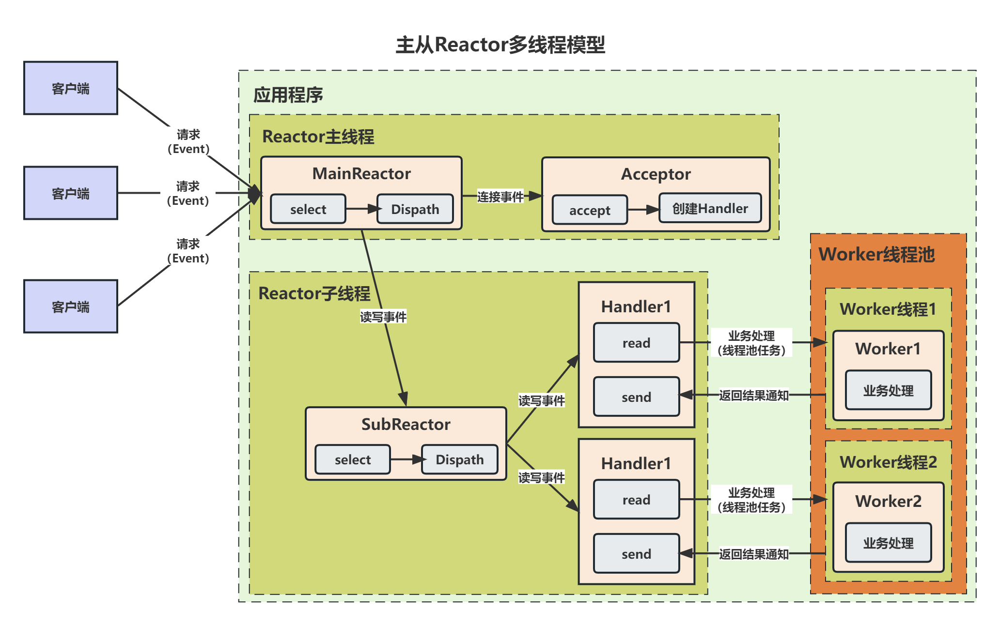

由上图可以看出，服务端处理网络请求流程的主要处理步骤包括：

1. **数据输入**：客户端与服务器建立连接发出请求，服务器接受请求，获取请求数据（步骤1～3）
2. **业务处理**：当服务器接受完请求，在用户空间处理客户端请求，并构建响应数据（步骤4）
3. **数据返回**：服务器将构建好的响应数据通过内核空间的网络IO发送给客户端（步骤5～7）

网络应用程序框架的高性能之处主要来自于其 IO模型 和 线程处理模型，前者决定如何收发数据，后者决定如何利用多线程处理客户端请求。

# 线程模型1：传统阻塞IO服务模型

传统阻塞IO服务模型是一种最基本的网络编程模型，它使用一个独立的 `Acceptor` 线程来监听客户端的连接，接受到请求后为每个客户端创建一个新的线程进行链路处理，处理完成后通过输出流返回应答给客户端。

**特点**：

1) 采用阻塞式IO模型（BIO）获取输入数据，线程在等待数据时会被挂起
2) 每个连接都需要一个独立的线程完成数据输入，业务处理和数据返回的完整操作
3) 由一个独立的 `Acceptor` 线程来监听客户端的连接，每当有客户端请求过来时，它就会为客户端分配一个新的线程来进行处理

**存在问题**：

1. 当并发数较大时，需要创建大量线程来处理连接，系统资源占用较大，甚至会导致系统资源耗尽
2. 建立连接后，如果当前线程长时间没有接收到数据，则线程就阻塞在 `read` 操作上，造成线程资源浪费

# 线程模型2：伪异步IO服务模型

伪异步IO服务模型是一种对传统阻塞IO服务模型的改进，它使用一个线程池来处理多个客户端的请求，线程池可以灵活调配线程资源，设置线程的最大值，防止由于海量并发接入导致线程资源耗尽。

**特点**：

1. 采用阻塞式IO模型（BIO）获取输入数据
2. 采用线程池处理客户端请求，线程池的占用资源是可控的，无论多少个客户端并发方法，都不会导致系统资源耗尽。

**存在问题**：

1. 伪异步IO服务模型的底层通信仍然采用的同步阻塞模型，因此还是会存在线程阻塞，浪费资源的问题。
2. 如果线程池中的大量线程阻塞时间过长，可能会导致阻塞队列占满，后续入队的操作将会被阻塞。由于只有一个`Accptor`线程接收客户端接入，入队操作被阻塞后会导致新的客户端请求会被拒绝，客户端发生大量连接超时。

# 线程模型3：Reactor模型

针对传统阻塞IO服务模型的2个缺点，比较常见的有如下解决方案：

1. **基于IO复用模型**：多个连接共用一个阻塞对象，应用程序只需要在一个阻塞对象上等待，无需阻塞等待所有连接。当某条连接有新的数据可以处理时，操作系统通知应用程序，线程从阻塞状态返回，开始进行业务处理。
2. **基于线程池复用线程资源**：不需要为每个连接创建线程，将连接完成后的业务处理任务分配给线程进行处理，一个线程可以处理多个连接的业务。

IO复用结合线程池，这就是Reactor模型的基本设计思想。Reactor 模型是一种基于事件驱动的设计模型，拥有一个或多个并发输入源，有一个服务处理器和多个事件处理器，服务处理器会同步的将输入的请求事件以多路复用的方式分发给相应的事件处理器。

Reactor模型主要包含三种角色：Reactor、Handler和Acceptor。Reactor负责监听和分发事件，Handler和Acceptor负责处理事件。

Reactor模式可以有效利用操作系统的IO多路复用机制，避免了不必要的轮询或阻塞，提高了程序的性能和响应性，适用于处理多个客户端并发向服务器请求服务的场景，比如网络服务器、聊天室、在线游戏等。

Reactor模型主要有三种实现方式：**单Reactor单线程模型**、**单Reactor多线程模型**和**主从Reactor多线程模型**，它们的性能和复杂度各不相同，需要根据实际的需求去选择。

## 单Reactor单线程模型

单Reactor单线程模型是指所有的IO操作都在同一个线程上完成，这个线程负责监听和分发事件，以及处理事件的业务逻辑。这种模型逻辑简单，但是性能较低，不能充分利用多核资源，也不能处理耗时的业务。

其中，`select` 是IO复用模型中的标准网络编程API，可以实现应用程序通过一个阻塞对象监听多路连接请求。

**方案说明**：

1. Reactor对象通过 `select`监控客户端请求事件，收到事件后通过 `Dispatch` 进行分发。
2. 如果是建立连接请求事件，则由 `Acceptor` 通过 `accept` 处理连接请求，然后创建一个 `Handler` 对象处理连接完成后的后续业务处理。
3. 如果不是连接事件，则 `Reactor` 会分发调用连接对应的 `Handler` 来相应。
4. `Handler` 完成 `read` -> 业务处理 -> `send`  的完整业务流程。

**优点**：模型简单，没有多线程、进程通信，竞争的问题，全部都在一个线程中完成。

**缺点**：

1. 性能问题：只有一个线程，无法充分发挥多核CPU的性能。Handler在处理某个连接上的业务时，整个进程无法处理其他连接事件，容易导致性能瓶颈。
2. 可靠性问题：线程处理业务耗时过长，或者进入死循环，会导致整个系统通信模块不可用，不能接受和处理外部消息，造成节点故障。

**适用场景**：客户端的数量有限，业务处理非常快速，比如 `Redis`。

## 单Reactor多线程模型

单Reactor多线程模型在单Reactor单线程模型的基础上做了优化，使用一个线程来监听和分发事件，以及连接请求的处理，使用一个线程池来处理事件的业务逻辑。这样可以避免事件处理阻塞主线程，提高并发性能。

**方案说明**：

1. Reactor对象通过 `select` 监控客户端请求事件，收到事件后通过 `Dispatch` 进行分发；
2. 如果是建立连接请求事件，则由 `Acceptor` 通过 `accept` 处理连接请求，然后创建一个 `Handler` 对象处理连接完成后的后续业务处理。
3. 如果不是建立连接事件，则 `Reactor` 会分发调用连接对应的 `Handler` 来相应；
4. `Handler` 只负责响应事件，不做具体业务处理，通过 `Read`读取数据后，会分发给后面的 `Worker` 线程池进行业务处理；
5. `Worker` 线程池会分配独立的线程完成真正的业务处理，完成业务逻辑后会将响应结果传递给 `Handler` 进行处理；
6.  `Handler` 收到响应结果后通过 `send` 将响应结果返回给客户端。

**优点**：可以充分利用多核CPU的处理能力，避免事件处理阻塞主线程，提高并发性能。

**缺点**：多线程的数据交互比较复杂，需要考虑线程安全问题；Reactor承担了所有事件的监听和响应，在单线程中运行，高并发场景下容易成为性能瓶颈。

## 主从Reactor多线程模型

主从Reactor多线程模型是在单Reactor多线程模型基础上进行了改进，它将Reactor线程拆分为了`MainReactor`和`SubReactor`，`MainReactor` 只处理连接事件，读写事件交给`SubReactor`处理。这样可以提高并发性和可扩展性。

**方案说明**：

1. Reactor主线程 `MainReactor` 对象通过`select`监控建立连接事件，收到事件后通过`Acceptor`接受，处理建立连接事件；
2. `Acceptor`处理建立连接事件后，`MainReactor`将连接分配给Reactor子线程`SubReactor`进行处理；
3. `SubReactor`将连接加入连接队列进行监听，并创建一个Handler用于处理各种连接事件；
4. 当有新的事件发生时，`SubReactor`会调用连接对应的Handler进行响应；
5. Handler通过`read`读取数据后，会分发给后面的`Worker`线程池进行业务处理；
6. `Worker` 线程池会分配独立的线程完成真正的业务处理，将响应结果传递给Handler处理；
7. Handler收到响应结果后通过 `send` 将响应结果返回给客户端。

**优点**：父线程与子线程之间数据交互简单、责任明确，父线程只需要接受新连接，子线程完成后续的业务处理；可以提高并发性能和可扩展性。

**缺点**：需要更多的线程资源和更复杂的调度逻辑；如果子线程处理不均衡，可能导致某些子线程过载而其他子线程空闲。

# 线程模型4：Proactor模型

Proactor模式基于AIO，应用程序向内核注册一个Proactor和Handler，将所有IO操作都交给内核来处理，内核完成数据读写后回调Handler完成业务处理。

Proactor是一种异步网络模型，详细方案如下：

1. Proactor Initialtor创建Proactor和Handler对象，并将Proactor和Handler都通过AsyOptProcessor（Asynchronous Operation Processor）注册到内核。
2. AsyOptProcessor处理注册请求，并处理IO操作。
3. AsyOptProcessor完成IO操作后通知Proactor。
4. Proactor根据不同的事件类型回调不同的Handler进行业务处理
5. Handler完成业务处理

**优点**：

1. 无需应用程序处理数据的读写，可以避免阻塞和上下文切换，提高性能。
2. 无需应用程序管理缓冲区，可以节省内存空间和避免错误。
3. 适合处理耗时长或复杂的业务逻辑。

**缺点**：

1. 编程实现复杂，由于异步操作流程的事件初始化和事件完成在时间和空间上都是互相分离的，因此开发异步应用更加复杂。应用程序还可能因为反向的流控变得更加难以debug。
2. 内存使用，缓冲区在读或写操作期间必须保持住，可能造成持续的不确定性，并且每个并发操作都要求有独立的缓存，相比Reactor模式，在Socket已经准备好读或写之前，是不要求开辟缓存的。
3. 操作系统支持，Windows下通过IOCP实现了真正的异步IO，而在Linux系统下，Linux 2.6才引入，目前异步IO还不完善。

# 参考资料

1. [高性能网络编程(六)：一文读懂高性能网络编程中的线程模型](http://www.52im.net/thread-1939-1-1.html)

