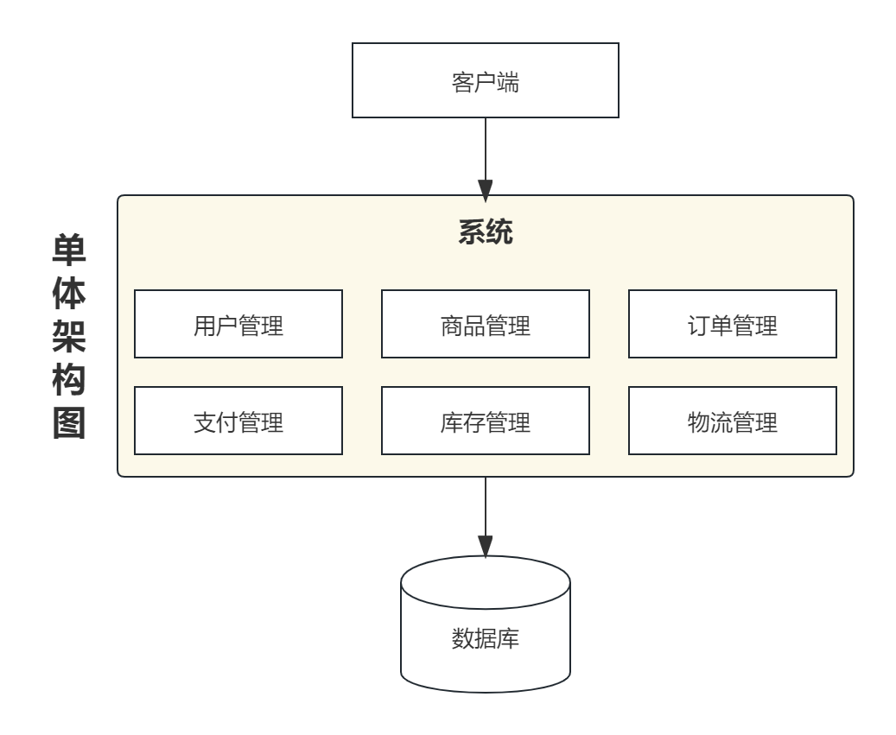
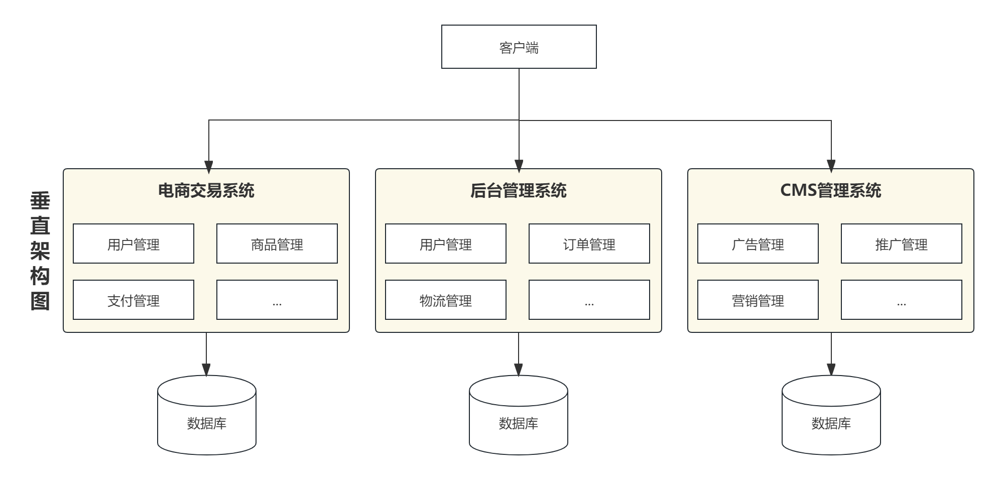
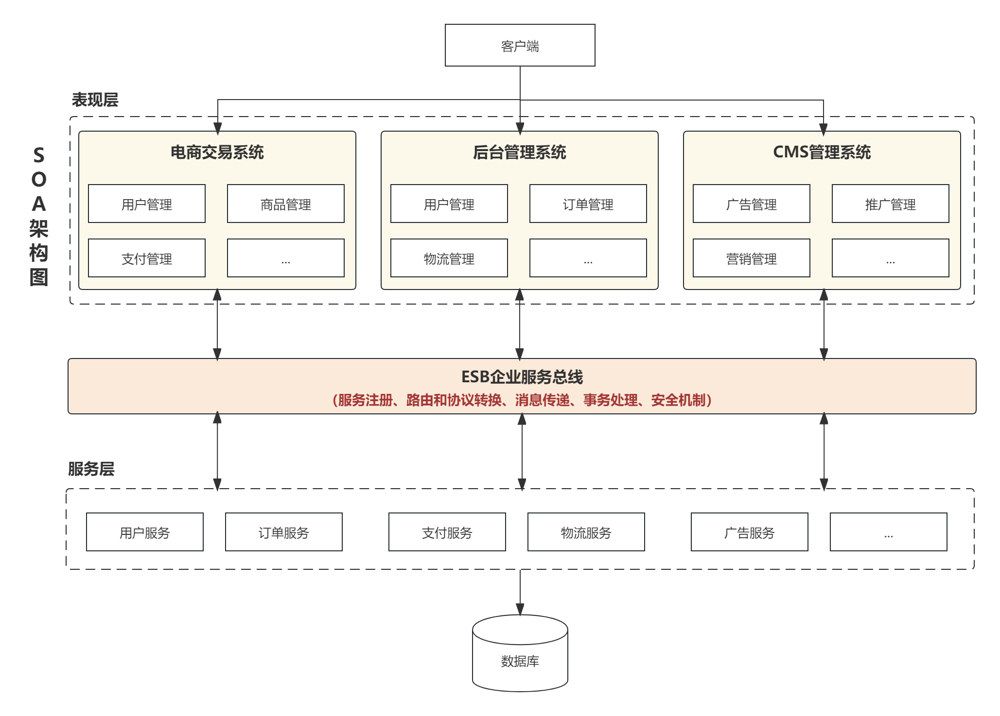
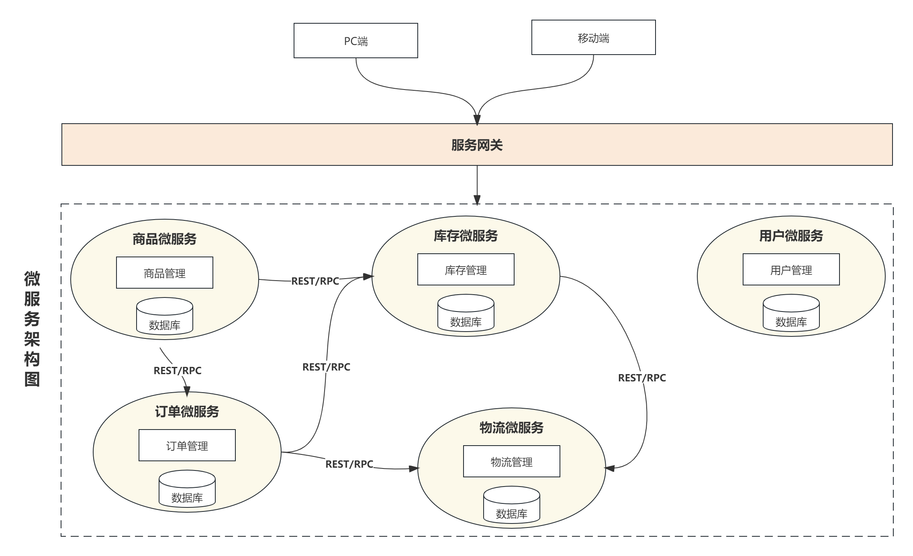

# 单体架构

在企业发展初期，一般公司的网站流量都比较小，只需要一个应用，将所有的功能代码打包成一个服务，部署到服务器上就能支撑公司的业务。这样也能够减少开发、部署和维护成本。

**单体架构是一种传统的软件架构模式，它将应用程序作为单个整体来构建和部署，所有的组件都在同一个进程中运行**。

比如说，大家都很熟悉的电商系统，里面涉及的业务主要有：用户管理、商品管理、订单管理、支付管理、库存管理和物流管理等模块，初期我们会将所有模块写道一个Web项目中，然后统一部署到一个Web服务器。

**优点**：

- **简单易用**：单体架构通常使用一种技术栈，将整个应用程序作为一个单一、紧密耦合的单元，因此其开发、测试和部署都相对简单。

- **高性能**：单体架构的各个组件都运行在同一个进程中，减少了组件之间的网络通信，提高了应用程序的性能。

**缺点**：

- **扩展性受限**：单体应用的所有组件都耦合在一起，如果需要更多的处理能力，只能通过升级硬件或者增加应用程序实例来提高性能，无法针对某个业务功能进行水平扩展。

- **难以维护**：随着应用程序的不断发展和维护，代码库会变得越来越庞大臃肿，代码的维护会变得越来越难。
- **技术升级困难**：单体架构的所有模块都使用一种技术栈，升级技术会影响整个系统，需要进行全局的测试和部署，升级难度较大。
- **故障容错性差**：所有的功能模块都运行在同一个进程中，一个功能出错或者故障，可能会导致整个应用程序崩溃。

单体架构适用于小型和中型的应用程序，特别是那些*规模较小，需要快速开发部署的应用*。在考虑使用单体架构时，需要考虑应用的规模、复杂性以及未来的扩展性需求。

# 垂直架构

随着企业业务的不断发展，功能越来越复杂，单体应用程序可能会变得臃肿和难以维护，基于单体架构的协作效率会越来越低。在这种情况下，可以使用垂直应用架构将应用程序拆分为多个独立的系统，每个系统负责特定的业务功能。

**垂直架构是一种软件架构，它将应用程序按照业务功能垂直地划分为多个独立的子系统，每个系统都负责特定的业务功能。系统之间通过API或消息传递进行通信，以实现数据和功能的交互和共享**。

这里，我们同样以电商系统为例，在垂直应用架构下，我们可以将整个电商项目拆分为：电商交易系统、后台管理系统、CMS管理系统等。

我们将单体应用架构拆分为垂直应用架构之后，一旦访问量变大，我们就只需要针对访问量大的业务增加服务器节点即可。

**优点**：

- **易于扩展和维护**：应用程序中的每个模块都专注于一项特定的业务领域，因此它们可以更容易的维护和修改。当需要扩展或更改系统中的某个特定功能时，只需要修改相应的应用程序，不影响系统的其他模块代码。
- **更高的可靠性**：每个模块都是独立的，其中某个模块发生了故障，不会影响其他模块的运行情况，提高了系统整体的可靠性。

- **更好的灵活性**：各个模块都是相互独立的，可以使用不同的技术栈来实现。也可以针对每个模块进行优化，以此来提升系统的整体性能。

**缺点**：

- **复杂性增加**：将应用程序分成了多个模块，需要考虑每个模块的职责和通信方式，增加了应用程序的复杂性。在应用程序的规模较大时，这种复杂性可能会变得更加突出。
- **重复开发**：拆分后的各模块之间难免存在重叠业务，会存在重复开发的业务，后期维护比较困难。
- **性能问题**：各模块之间通过API或消息传递进行通信，可能会存在通信延迟的情况。

垂直应用架构适用于复杂的业务系统，其中不同的业务领域需要独立开发、部署和扩展。该架构提供了松耦合、高内聚的解决方案，使得系统更易于维护和扩展，同时也可以提高系统的可靠性和性能。

# SOA架构

我们将系统演变为垂直应用架构之后，当垂直应用越来越多，重复编写的业务代码就会越来越多。我们将重复的代码抽象出来，形成统一的服务供其他系统或者业务模块调用，此时系统就会演变为SOA架构。

**SOA是一种面向服务的架构风格，它将应用程序中的不同功能组件划分为可独立调用的服务，并通过标准化的接口和协议实现这些服务之间的交互。**

SOA中服务之间的通信可能涉及多种协议和接口，以及不同的安全和事务处理机制，因此需要一个中间件来管理和协调服务之间的通信。ESB是企业服务总线（Enterprise Service Bus）的简称，是SOA中间件的一种实现方式。

**优点**：

- **松耦合**：SOA架构的服务是独立的单元，服务之间是松散耦合的，它们可以独立开发、测试、部署和升级，使得系统更加灵活、可维护和可扩展。
- **可重用性**：SOA架构的服务是可重用的，服务可以在不同的应用程序中共享和重用，避免了重复的开发工作，提高了开发效率和系统的可靠性。
- **模块化**：SOA架构的服务是模块化的，服务可以根据业务需求进行组合和拆分，形成一个完整的业务流程，使得系统更加灵活、可配置和可定制。
- **面向服务**：SOA架构的设计思想是面向服务的，服务是系统的核心组成部分，它们可以提供不同的功能和接口，可以被不同的应用程序或系统重复使用，从而实现了业务逻辑的复用和分离。
- **与技术无关**：SOA架构是与技术无关的，它可以使用不同的编程语言、协议和平台实现，可以与不同的技术环境和系统集成。

**缺点**：

- **单点故障**：SOA架构中服务之间的通信都是通过ESB来进行的，如果ESB故障就会导致整个应用系统故障不可用。
- **复杂性高**：SOA架构的实现和维护比较复杂，需要考虑服务之间的协作、通信和事务处理等问题，需要具备一定的技术和管理能力。
- **性能问题**：SOA架构的服务通信是基于网络的，会带来一定的延迟和带宽消耗，对于实时性和性能要求较高的系统可能会受到影响。

# 微服务架构

基于SOA架构的思想，为了满足移动互联网对大型项目及多客户端的需求，对服务层进行细粒度的拆分，所拆分的每个服务只完成某个特定的业务功能，比如订单服务只实现订单相关的业务，用户服务只实现用户管理相关的业务等，服务的粒度很小，所以被称为微服务。

**微服务是一种架构风格，它将应用程序拆分成小型、独立的服务，每个服务都运行在自己的进程中，并通过网络进行通信，每个微服务都有自己的数据库。**

微服务架构的设计原则是“单一职责原则”和“服务自治原则”。单一职责原则是指每个服务都应该有一个特定的、清晰的功能，并且这个功能应该由这个服务完全负责。服务自治原则是指每个服务都应该是相互独立的，可以独立运行、测试、部署和扩展。

**优点**：

- **高可扩展性**：由于每个服务都是独立的，可以根据需要独立地扩展某个服务，不需要针对整个应用进行扩展。
- **灵活性**：微服务架构的模块化结构使得应用程序更加灵活，可以快速地适应业务需求变化。
- **独立部署**：每个微服务都可以独立部署，这意味着可以在不影响整个应用程序的情况下进行单个模块的升级或修复。
- **技术多样性**：微服务架构可以使用不同的编程语言、框架和技术栈来开发每个模块，从而为开发人员提供跟多的选择。
- **高可维护性**：对微服务的某一个服务的更改不会影响到其他服务，这使得应用程序更加容易维护。

**缺点**：

- **复杂性**：微服务架构中有许多小型的服务，这会增加应用程序的复杂性，需要更多的管理和协调工作。
- **分布式系统**：微服务架构是一个分布式系统，需要处理分布式事务、网络延迟和故障处理等问题。
- **需要更多的测试**：微服务架构中有很多服务，需要进行更多的单元测试、集成测试和端到端测试。
- **bug定位困难**：微服务系统中的某个操作可能需要多个服务协同完成，调用链过长可能会导致bug定位困难。
- **数据一致性问题**：由于每个微服务都有自己的一套数据库，需要考虑数据一致性问题。
- **更多的监控和日志记录**：由于微服务架构的服务数量增加，因此需要更多的监控和日志记录来确保服务的可靠性和性能。
- **更高的成本和技术要求**：微服务架构需要更高的成本和技术要求，需要更多的开发人员、运维人员和服务器资源来支持。

# 参考资料

1. [软件架构的发展历程](https://blog.csdn.net/peanutwzk/article/details/108344580)
2. [系统由单体架构到微服务架构到底是如何演进的？](https://www.51cto.com/article/665590.html)
