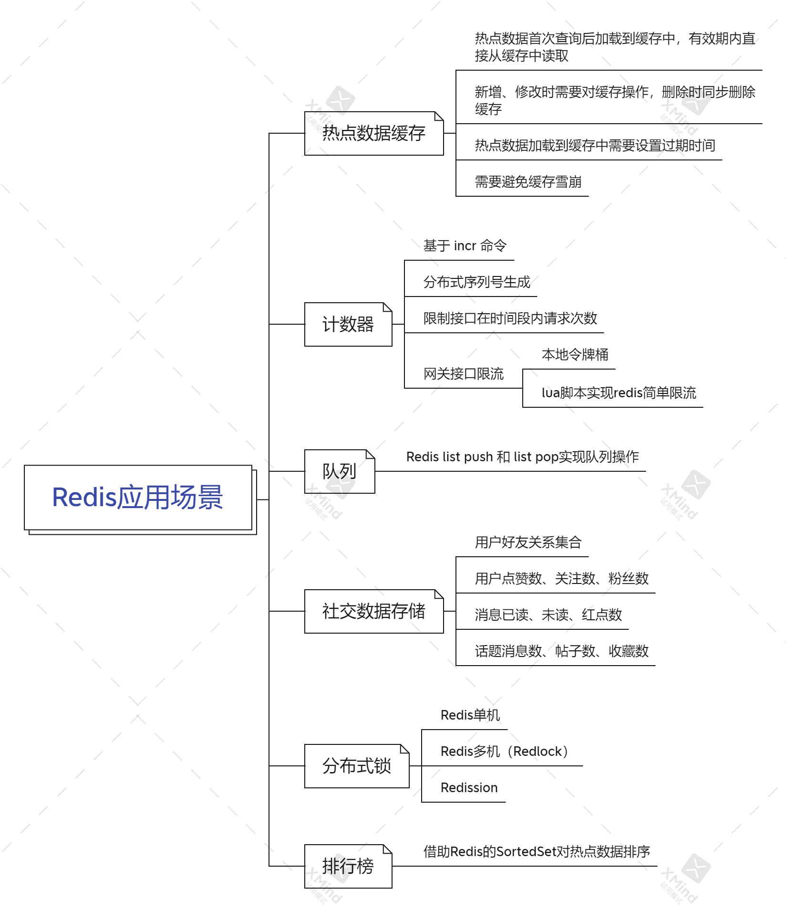
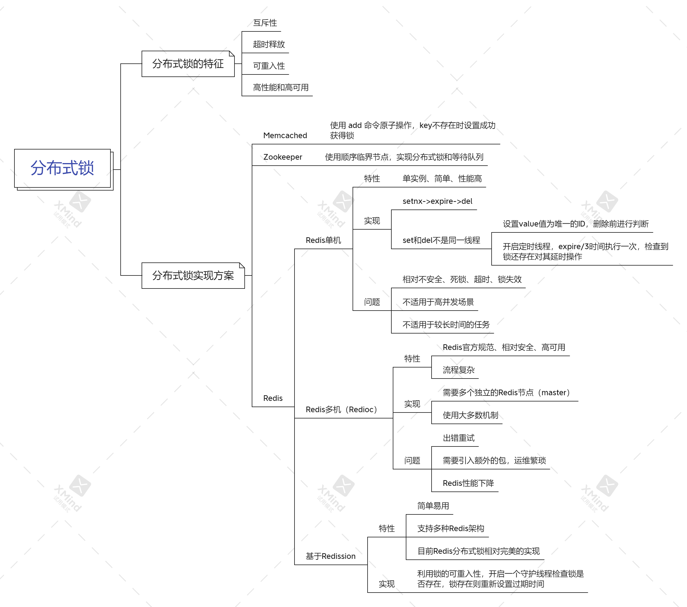

# 缓存

作为高性能的Key-Value内存数据库，日常中最常用的使用场景就是数据缓存。只需要通过 `String` 类型将待缓存数据对象通过序列化后缓存起来即可。但使用时也有一些需要注意的点：

- 必须保证不同缓存内容的key不会重复，并且尽可能短。可以使用对象主键等。
- 对于热点数据在数据库新增或查询后将其放入缓存，修改后更新缓存，删除后对应去除缓存。同时也需要对其设置过期时间。
- 合理利用缓存接口、网站访问速度，同时能够有效降低数据库压力。
- Redis提供键过期，可以将其作为缓存过期淘汰策略。

# 计数器

Redis 提供了 `incr` 命令来实现计数功能，通过内存操作性能高，能够很好适用于这些场景：

- 社交业务产品统计功能：
  - 用户点赞数、关注数、粉丝数
  - 帖子点赞数、评论数、热度
  - 消息已读、未读，红点消息数
  - 话题消息数、帖子数、收藏数
- 统计网站、接口的调用次数等。

# 限流

限流是一种限制某些操作、接口执行访问速率的操作。例如网关限制接口访问频次，针对于用户维度、全局维度来控制接口的访问频率。

- MQ防止重复消费同样可以利用  `incr` 计数，保证时间段内只会被消费一次。
- 接口限流，限制接口时间段内请求次数上限。
- 限流方式：本地令牌桶；`lua` 脚本使用 `incr` 实现 Redis 简单限流。

# 队列

Redis有 `list push` 和 `list pop` 这样的命令，可以很方便的执行队列操作。但是一般情况下不使用。

# 分布式锁

在分布式场景中，对同一资源的并发访问（比如全局ID、库存减少、秒杀、订单状态一致性等），并发量不大情况下可以使用数据库悲观锁、乐观锁来实现。但是在高并发场景中，利用数据库锁机制来控制资源会很大程度影响数据库的性能。此时可以使用Redis的 `setnx` 功能来编写分布式锁，进行操作时来获取分布式锁，当然实际操作中需要考虑到更多细节内容。

# 排行榜

使用Redis的`sortedset`操作对热点数据进行排序。展示一段时间点赞量最多的帖子等。

# 参考资料

1. [Redis应用场景](https://juejin.cn/post/6997315471426977805)